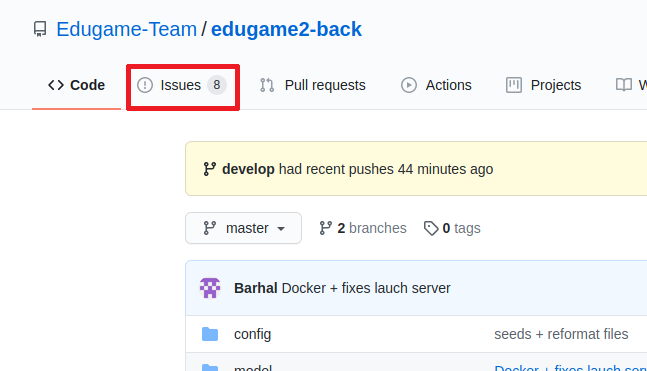
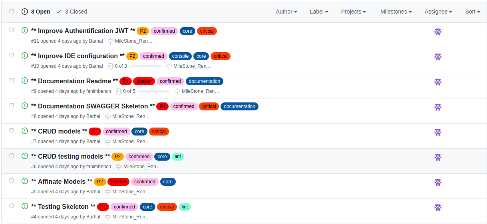
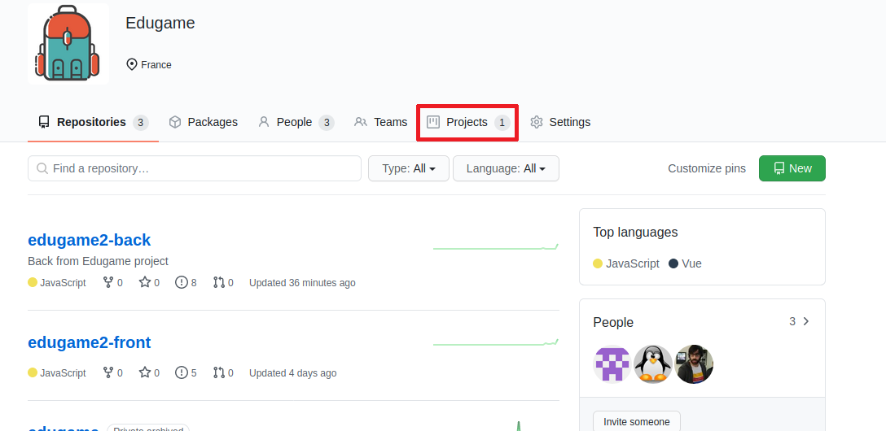
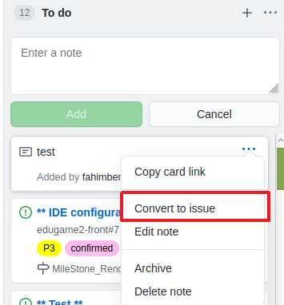
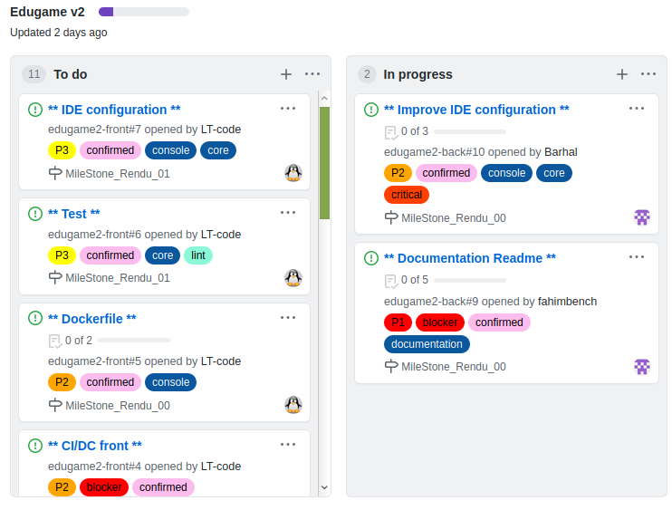
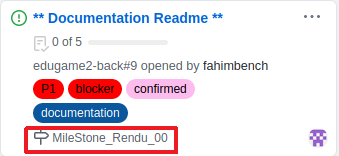

# edugame2-front
Frontend du projet Edugame2


## Status

| Language | Action | Coveralls |
|:--------:|:------:|:---------:|
|  |  |  |

## Sommaire

- [Description](#description)
- [Prérequis](#prérequis)
- [Installation (avec docker)](#installation-avec-docker)
- [Installation (sans docker)](#installation-sans-docker)
- [Les issues](#les-issues)
- [Agile](#agile)
- [Les permissions](#les-permissions)
- [Intégration continue](#intégration-continue)
- [FAQ](#FAQ)
- [Liens](#liens)
- [Glossaire](#glossaire)
- [Auteurs](#auteurs)
- [Licence](#licence)

## Description

[todo]

## Prérequis

 - [Node.js](https://nodejs.org/en/) est nécessaire si le projet est lancé sans docker.
 - [Yarn](https://classic.yarnpkg.com/fr/docs/install/#windows-stable) est le gestionnaire de dépendances utilisé dans ce projet.

## Installation

 - **yarn install** afin d'installer les dépendances nécessaires du projet.
 - **yarn web** pour lancer l'application sur une vue web.

## Running the tests

Test are not working yet. Althougth, it will be available soon for the milestone 1.

```bash
$ yarn test
```

j# Les issues

Le système d'issues de github n'est pas le plus complet mais il permet d'avoir tout de même un bon suivi.

Vous pouvez créez des catégories (labels), assigner les tâches, les estimer, gérer des roadmaps, ajouter des fichiers, commenter, recevoir des notifications, etc... un lieu idéal pour centraliser les discussions autour d'un projet et favoriser la collaboration transparente.

Pour accéder aux issues du projet :



Vous accédez alors à la liste des issues du projet



La création des issues se font directement sur le kanban accessible depuis la racine de la team:



Cliquez sur le projet "Edugame v2", Créer une note puis la convertir en issue :



Créer une bonne issue est essentiel pour sa résolution. Chaque issue doit être explicite, avec **un cas reproductible** en cas de remontée de bug. Vous pouvez avoir quelques pistes pour [rédiger un bon rapport de bug ici](http://blogtorop.fr/comment-faire-un-bon-rapport-de-bug/).

### Agile

Les issues sont organisées dans des "boards" type "kanban".



Les issues peuvent être groupés par "milestones" (sprints). Ceci permet de grouper des tâches pour en suivre la complétion.



## Les permissions

Les membres de l'équipe ont des permissions qui diffères d'un role à l'autre.


Permission                  | Members | Admin  | Owner
----------------------------|:-------:|:------:|:------:
Voir les Issues             |    ✔    |   ✔    |   ✔   |
Gérer les issues            |    ✔    |   ✔    |   ✔   |
Effacer une issue           |    ⨯    |   ✔    |   ✔   |
Lire le wiki                |    ✔    |   ✔    |   ✔   |
Editer le wiki              |    ✔    |   ✔    |   ✔   |
Commenter                   |    ✔    |   ✔    |   ✔   |
Edit un commentaire         |    ⨯    |   ✔    |   ✔   |
Lire le code                |    ✔    |   ✔    |   ✔   |
Contribuer (merge request)  |    ✔    |   ✔    |   ✔   |
git push                    |    ✔    |   ✔    |   ✔   |
Gérer l'équipe projet       |    ⨯    |   ✔    |   ✔   |
Transférer un projet        |    ⨯    |   ✔    |   ✔   |
Effacer un project          |    ⨯    |   ✔    |   ✔   |
Voir les jobs               |    ✔    |   ✔    |   ✔   |
Configurer les hooks        |    ⨯    |   ✔    |   ✔   |
Voir les environments       |    ⨯    |   ✔    |   ✔   |
Créer un environment        |    ⨯    |   ✔    |   ✔   |

## Intégration continue

[todo]

## FAQ

[todo]

## Liens

 - [L'art de faire des commits atomiques](http://adopteungit.fr/methodologie/2017/04/26/commits-atomiques-la-bonne-approche.html)
 - [L'art de faire des issues efficaces](https://www.lesintegristes.net/2011/10/19/rediger-un-rapport-de-bugs-ca-na-pas-lair-pas-mais-cest-du-boulot/)

## Glossaire
 - **intégration continue** : pratique qui consiste à vérifier chaque modification du code source pour prévenir les régressions.  Le principal but de cette pratique est de détecter les problèmes d'intégration au plus tôt lors du développement. De plus, elle permet d'automatiser l'exécution des suites de tests et de voir l'évolution du développement du logiciel.
 - **devops** : mouvement visant à l'alignement de l'ensemble des équipes du système d'information sur un objectif commun, à commencer par les équipes de dev ou dev engineers chargés de faire évoluer le système d'information et les ops ou ops engineers responsables des infrastructures.
 - **commit** :  Fait d'enregistrer dans un outil de gestion de versions une nouvelle version d'un ensemble de fichiers.
 - **release** : version fixée d'une réalisation
 - **issue** : Un ticket qui permet de définir une feature ou un bug.
 - **repository** : Un projet au sens GIT
 - **origin** : GIT étant décentralisé, `origin` est le nom conventionnel du serveur par défaut
 - **upstream** : Lorsque l'on copie (fork) un projet, `upstream` représente le repository d'origine par convention
 - **fourcher/forker** : copier intégralement un repository

## Auteurs

* **Fahim BENCHAABANE** - <fahim.benchaabane@epitech.eu> - [fahimbench](https://github.com/fahimbench)
* **Arnaud Heymans** - <arnaud.heymans@epitech.eu> - [Barhal](https://github.com/Barhal)
* **Thomas Lopez** - <thomas.lopez@epitech.eu> - [LT-code](https://github.com/LT-code)

## Licence
[](https://opensource.org/licenses/Apache-2.0)


